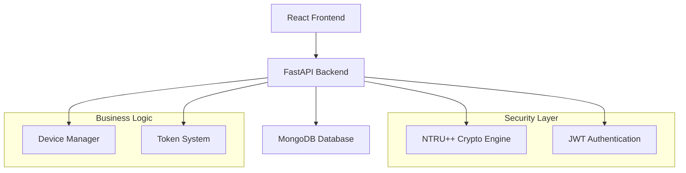

<div align="center">

# 🛡️ QuantumShield

### *Post-Quantum Cryptography Platform for IoT Security*

[](https://github.com/LeZelote01/QuantumShield_MVP-1)
[](LICENSE)
[](https://fastapi.tiangolo.com)
[](https://reactjs.org)
[](https://mongodb.com)

*Securing IoT devices against quantum computing threats through advanced post-quantum cryptography*

[🚀 **Live Demo**](http://localhost:3000) • [📖 **Documentation**](http://localhost:8001/docs) • [🎯 **Roadmap**](MVP_PHASING_ROADMAP.md) • [🐛 **Report Bug**](../../issues)

</div>

---

## 🎯 **Overview**

**QuantumShield** is a cutting-edge **post-quantum cryptography platform** designed to protect IoT devices from future quantum computing attacks. Built with modern web technologies, it provides enterprise-grade security through **NTRU++ cryptographic algorithms** while maintaining an intuitive user experience.

### 🌟 **Why QuantumShield?**

- 🔐 **Quantum-Resistant**: Built with NTRU++ post-quantum cryptography
- 📱 **IoT-Focused**: Specialized for smart device security management  
- 💰 **Token Economy**: Gamified security with QS rewards system
- 🚀 **Modern Stack**: FastAPI + React 19 + MongoDB
- 🆓 **Zero Cost**: Deployable with free hosting solutions

---

## ✨ **Key Features**

### 🔐 **Post-Quantum Cryptography**
- **NTRU++** algorithm implementation with 2048-bit keys
- Advanced encryption/decryption capabilities
- Digital signature creation and verification
- Performance metrics and benchmarking

### 📱 **IoT Device Management** 
- Support for **3 device types**: Smart Sensors, Security Cameras, Smart Thermostats
- Real-time heartbeat monitoring
- Device status management (Active/Inactive/Maintenance)
- Cryptographic key assignment for each device

### 💰 **QS Token Economy**
- Automated reward system for user engagement
- **50 QS** initial balance + **5 QS** login bonus
- **+10 QS** per device registration
- **+1 QS** per daily heartbeat
- Complete transaction history tracking

### 📊 **Real-Time Dashboard**
- Live system metrics and performance indicators
- User activity feed with detailed timestamps
- Device health monitoring and alerts
- Interactive statistics and visualizations

### 🔒 **Security & Authentication**
- JWT-based secure authentication
- Protected routes and role-based access
- Encrypted wallet generation
- Session management and token refresh

---

## 🏗️ **Architecture**

<div align="center">



</div>

### 🔧 **Tech Stack**

| Component | Technology | Version | Purpose |
|-----------|------------|---------|---------|
| **Frontend** | React | 19.0.0 | Modern UI with Tailwind CSS |
| **Backend** | FastAPI | 0.110.1 | High-performance API server |
| **Database** | MongoDB | 6.0+ | Document-based data storage |
| **Crypto** | NTRU++ | Custom | Post-quantum cryptography |
| **Auth** | JWT | - | Secure token-based authentication |

---

## 🚀 **Quick Start**

### **Prerequisites**
```bash
Node.js 18+    # Frontend runtime
Python 3.11+   # Backend runtime  
MongoDB 6.0+   # Database server
Git            # Version control
```

### **Installation**

1. **Clone the repository**
   ```bash
   git clone https://github.com/LeZelote01/QuantumShield_MVP-1.git
   cd QuantumShield_MVP-1
   ```

2. **Setup Backend**
   ```bash
   cd backend
   python -m venv venv
   source venv/bin/activate  # Linux/Mac
   # venv\Scripts\activate   # Windows
   pip install -r requirements.txt
   ```

3. **Setup Frontend**
   ```bash
   cd ../frontend
   yarn install
   ```

4. **Configure Environment**
   ```bash
   # Backend .env
   cp backend/.env.example backend/.env
   
   # Frontend .env  
   cp frontend/.env.example frontend/.env
   ```

5. **Start Services**
   ```bash
   # Terminal 1: Start Backend
   cd backend && python server.py
   
   # Terminal 2: Start Frontend
   cd frontend && yarn start
   ```

6. **Access Application**
   - 🎨 **Frontend**: http://localhost:3000
   - ⚙️ **Backend API**: http://localhost:8001
   - 📖 **API Docs**: http://localhost:8001/docs

---

## 📱 **Usage Examples**

### **User Registration**
```javascript
// Create account with automatic QS rewards
const response = await fetch('/api/auth/register', {
  method: 'POST',
  body: JSON.stringify({
    username: 'alice',
    email: 'alice@example.com', 
    password: 'SecurePass123!'
  })
});
// Result: 50 QS initial + 5 QS bonus = 55 QS total
```

### **Device Registration**
```javascript
// Register IoT device with crypto keys
const device = await fetch('/api/devices/register', {
  method: 'POST',
  body: JSON.stringify({
    device_id: 'sensor-001',
    device_name: 'Temperature Sensor',
    device_type: 'Smart Sensor'
  })
});
// Result: Device registered + 10 QS reward
```

### **NTRU++ Encryption**
```javascript
// Generate quantum-resistant keys
const keyPair = await fetch('/api/crypto/generate-keys', {
  method: 'POST',
  body: JSON.stringify({ key_size: 2048 })
});

// Encrypt sensitive data
const encrypted = await fetch('/api/crypto/encrypt', {
  method: 'POST', 
  body: JSON.stringify({
    data: 'Secret IoT telemetry data',
    public_key: keyPair.public_key
  })
});
```

---

## 🗂️ **Project Structure**

```
QuantumShield/
├── 📁 backend/               # FastAPI Application
│   ├── server.py            # Main application entry
│   ├── routes.py            # API endpoint definitions  
│   ├── models.py            # Pydantic data models
│   ├── database.py          # MongoDB connection
│   ├── auth_service.py      # Authentication logic
│   ├── ntru_service.py      # Post-quantum crypto
│   ├── device_service.py    # IoT device management
│   ├── token_service.py     # QS token system
│   └── dashboard_service.py # Analytics & metrics
├── 📁 frontend/             # React Application  
│   ├── src/
│   │   ├── pages/          # Main application pages
│   │   ├── components/     # Reusable UI components
│   │   ├── services/       # API integration layer
│   │   └── contexts/       # React state management
│   └── public/             # Static assets
├── 📁 Mobile/              # React Native (Future)
└── 📄 MVP_PHASING_ROADMAP.md # Development roadmap
```

---

## 🧪 **API Documentation**

### **Authentication Endpoints**
| Endpoint | Method | Description | Response |
|----------|--------|-------------|----------|
| `/api/auth/register` | POST | Create new user account | User profile + JWT |
| `/api/auth/login` | POST | Authenticate user | Access token + profile |
| `/api/auth/profile` | GET | Get current user info | User details |

### **Cryptography Endpoints**
| Endpoint | Method | Description | Response |
|----------|--------|-------------|----------|
| `/api/crypto/generate-keys` | POST | Generate NTRU++ key pair | Public/Private keys |
| `/api/crypto/encrypt` | POST | Encrypt data | Encrypted payload |
| `/api/crypto/decrypt` | POST | Decrypt data | Original plaintext |
| `/api/crypto/sign` | POST | Create digital signature | Signature string |
| `/api/crypto/verify` | POST | Verify signature | Boolean result |

### **Device Management Endpoints**
| Endpoint | Method | Description | Response |
|----------|--------|-------------|----------|
| `/api/devices/register` | POST | Register IoT device | Device profile + 10 QS |
| `/api/devices/` | GET | List user devices | Device array |
| `/api/devices/{id}/heartbeat` | POST | Send device status | Heartbeat + 1 QS |
| `/api/devices/{id}/metrics` | GET | Get device analytics | Metrics object |

---

## 📈 **Development Roadmap**

| Phase | Budget | Timeline | Key Features |
|-------|--------|----------|--------------|
| **Phase 1** ✅ | **$0/month** | *Completed* | Core MVP, 3 IoT types, NTRU++, QS tokens |
| **Phase 2** 🚧 | **$15/month** | *Q2 2025* | Blockchain, mining, 8 IoT types, anomaly detection |  
| **Phase 3** 📋 | **$60/month** | *Q3 2025* | Multi-algo crypto, 2FA, ML analytics, MQTT/CoAP |
| **Phase 4** 🎯 | **$200+/month** | *Q4 2025* | Enterprise features, cloud integrations, full AI/ML |

*See [MVP_PHASING_ROADMAP.md](MVP_PHASING_ROADMAP.md) for detailed roadmap*

---

## 🤝 **Contributing**

We welcome contributions from the community! Here's how to get started:

### **Development Setup**
```bash
# Fork the repository
git clone https://github.com/your-username/QuantumShield_MVP-1.git

# Create feature branch  
git checkout -b feature/amazing-feature

# Make your changes and test thoroughly
python -m pytest backend/tests/
yarn test --coverage

# Commit with conventional commits
git commit -m "feat: add quantum key rotation feature"

# Push and create Pull Request
git push origin feature/amazing-feature
```

### **Guidelines**
- ✅ Follow [Conventional Commits](https://conventionalcommits.org/)
- ✅ Add tests for new features 
- ✅ Update documentation accordingly
- ✅ Ensure all tests pass before submitting PR

---

## 📄 **License**

This project is licensed under the **MIT License** - see the [LICENSE](LICENSE) file for details.

---

## 🙏 **Acknowledgments**

- **NTRU Cryptography**: Based on post-quantum cryptographic research
- **FastAPI**: High-performance web framework for building APIs
- **React Community**: Modern frontend development ecosystem
- **MongoDB**: Flexible document database for IoT data
- **Tailwind CSS**: Utility-first CSS framework

---

## 📞 **Support & Contact**

<div align="center">

### **Need Help?**

[](../../issues)
[](../../discussions)

**💬 Community**: [GitHub Discussions](../../discussions) • **🐛 Bug Reports**: [GitHub Issues](../../issues) • **📧 Email**: [contact@quantumshield.io](mailto:contact@quantumshield.io)

</div>

---

<div align="center">

### **⭐ Star this repository if you find it helpful!**

**Built with ❤️ for the post-quantum future**

*QuantumShield - Protecting IoT devices from quantum computing threats*

</div>